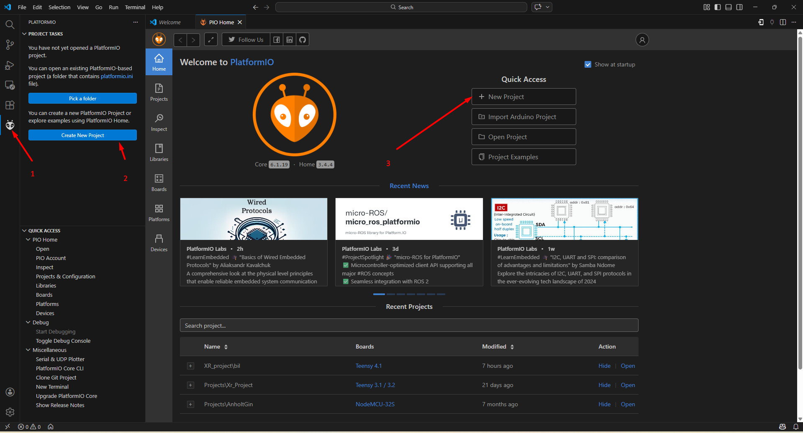
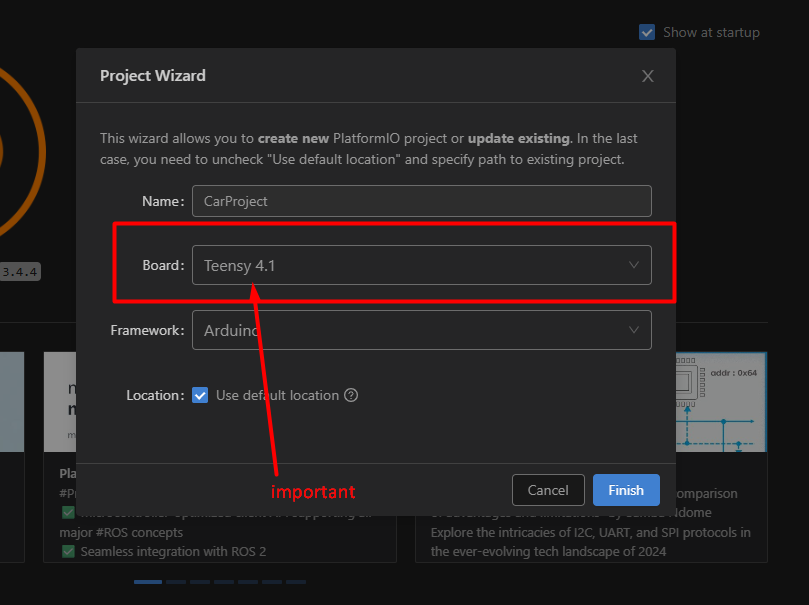
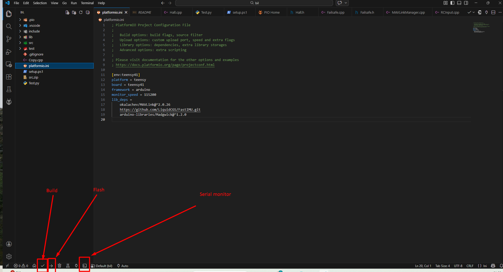

# Set up guide for platformIO

>**Created by:** Tobias Albertsen  
>**Date:** 2026-03-12  
>## Edit History
>
>| Date       | Author      | Change |
>|------------|-------------|-------|
>| yyyy-mm-dd | {Your Name} | {your changes} |
>| yyyy-mm-dd | {Your Name} | {your changes} |

PlatformIO er muligvis fremmede for dig, men det vil gøre jorden et lidt bedere sted efter du har fået sat det op. 

- [Go to Setup](#Setup)

- [Go to Bibloteker](#Bibloteker)

- [Go to Build and flash](#build-og-flash)


## Setup

Det er ganske nemt at sætte et projekt op i platformIO, følg blot de to sped neden under og du burde være good to go. 

### Step 1



### Step2



## Bibloteker

I platformIO skal biblotekerne ligges i `platformio.ini` det skulle være muligt at kopiere koden den for direkte ind.

```ini
[env:teensy41]
platform = teensy
board = teensy41
framework = arduino
monitor_speed = 115200
lib_deps = 
	okalachev/MAVLink@^2.0.26
	https://github.com/LiquidCGS/FastIMU.git
	arduino-libraries/Madgwick@^1.2.0
```

## build og flash


