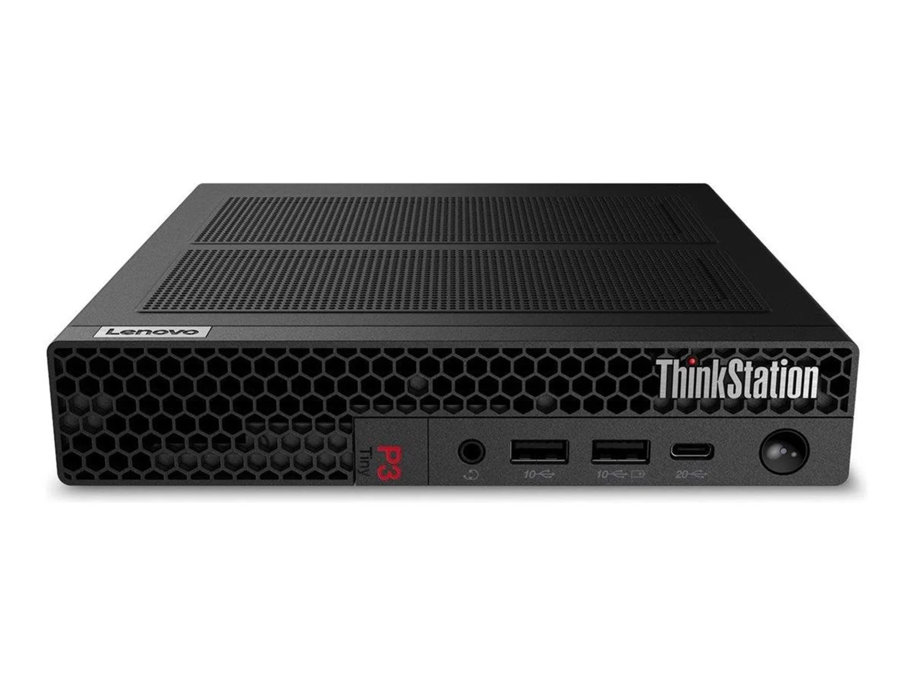

# Start up guide for the car

>**Created by:** Tobias Albertsen  
>**Date:** 2026-03-12  
>## Edit History
>
>| Date       | Author      | Change |
>|------------|-------------|-------|
>| yyyy-mm-dd | {Your Name} | {your changes} |
>| yyyy-mm-dd | {Your Name} | {your changes} |

Følgende to lister indeholder henholdsvis ting som skal og ting som kan tændes for at bilen virker og i nævnte række følge

## SKAL!

-   Tænd den lille thinkpad pc som står til censtre på bordet, den ser ca. sådan ud: 

pas på, vi snakker linux!
(få kodeordet ved henrik)

- Åben FØRST: OpenHDGroundStation og når du vurdere den bare står og tænker, åben QHDOpen (IKKE OMVENDT)

- tilslut rettet til computeren med det usb kabel som muligvis sidder i den anden computer. 

- sørger for at bilen er hævet fra jorden (der findes to holdere) og er slukket på den lille kontakt under gummi membramen og den lille kontakt kontakt oppe foran i bilen. 

- Tilslut den ene batteri (eller dem begge to hvis der stadig ikke er fundet en løsning dd: 12-03-2026). 

- Tænd nu på kontakten unden gummi membramen og vent til der kommet billede på skærmen på den computer som du netop har tændt. (der skal naturligvis være sat en skærm til computeren, men det antager jeg der er, nu hvor du er så langt).

- Når du du kan se at billedet på skærmen virker, betyder det at der er hun igennem. Dette vil typisk tage mellem 10 og 30 skunder. 

- Der kan nu tændes for motoren og styring. Dette gøres forest på bilen, på en lille switch på bilens styrbord side.

- Drej lidt på rette, hvis hjulene bevæger sig er der hul igennem. 

- For at kunne bruge speederen, skal du sikre dig at ingen ledninger sidder fast i dækkene. Tryk nu to gange på gear up bag på rettet og derefter lidt på speederen.

## kan 

Det er også muligt at bruge VR og motion platform (jeg aner ikke hvordan)