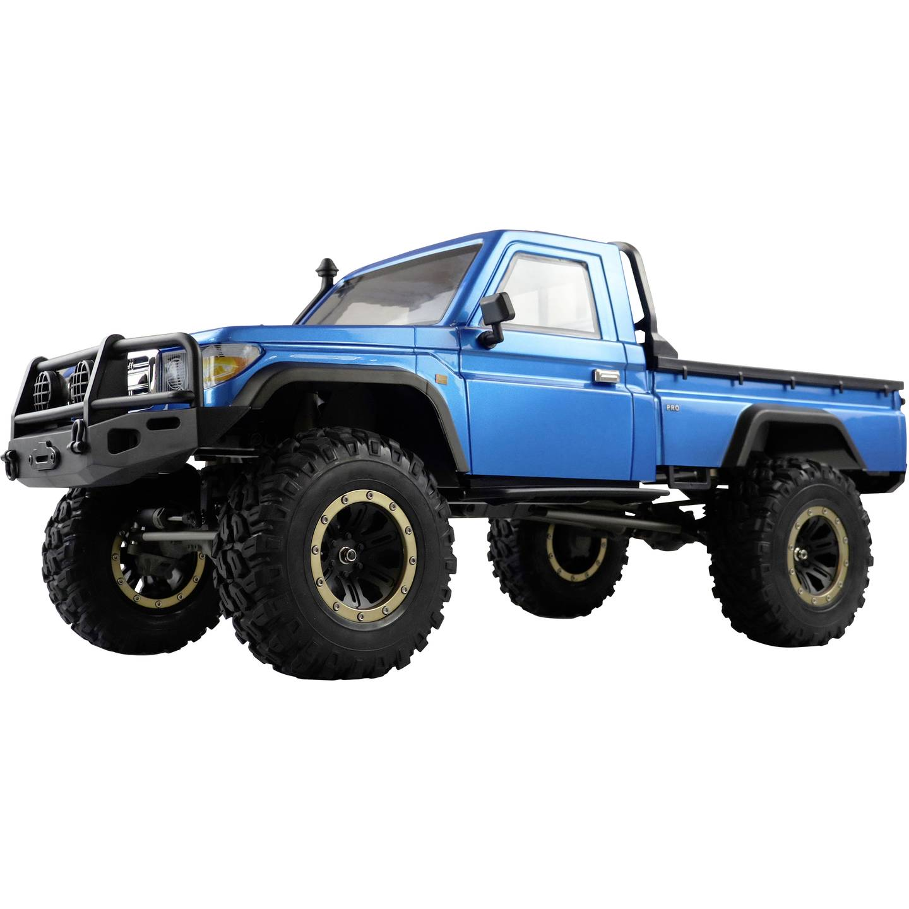

# FANATEC RC Flight Controller Setup

This repository contains documentation, firmware, and setup guides for the RC crawler project using a **Teensy 4.1 flight controller**, **Fanatec steering wheel**, and **OpenHD system**.

The documentation is split into several sections covering hardware, software, setup, and debugging.

---

# Documentation

## Hardware and Software Documentation

* [Hardware Components List](Instructions_and_docs/HW_and_SW_doc/Hardware_list.md)
* [Firmware Libraries](Instructions_and_docs/HW_and_SW_doc/Firmware_libraries.md)
* [PWM Steering Measurements](Instructions_and_docs/HW_and_SW_doc/PWM_test_wheel.md)

These documents describe the hardware used in the system, required firmware libraries, and measured PWM signals for steering calibration.

---

## Development Environment Setup

* [PlatformIO Setup Guide](Instructions_and_docs/Set_up_PlatformIO/This_is_how_to_set_up_PlatformIO.md)

This guide explains how to configure the development environment for building and flashing the firmware.

---

## Running the RC Car System

* [How to Setup and Run the System](Instructions_and_docs/start_up_car/How_to_setup_and_run_the_system.md)

This document explains how to start the full system including the air unit, flight controller, and RC control interface.

---

## Debugging

* [Debugging the Start Up Process](Instructions_and_docs/DEBUG_THE_CAR.md)

Contains known issues and troubleshooting steps for common hardware and software problems.

---

# Firmware

The firmware for the flight controller can be found in:

`SWIGX_RCFC_MPU6050_Teensy32`

This code runs on the **Teensy 4.1** and handles:

* PWM steering control
* throttle and braking
* sensor fusion from MPU6050
* communication with the OpenHD system

---

>## Edit History
>
>| Date       | Author      | Change |
>|------------|-------------|-------|
>| 2026-03-12 | Tobias Albertsen | A lot |
>| yyyy-mm-dd | {Your Name} | {your changes} |
